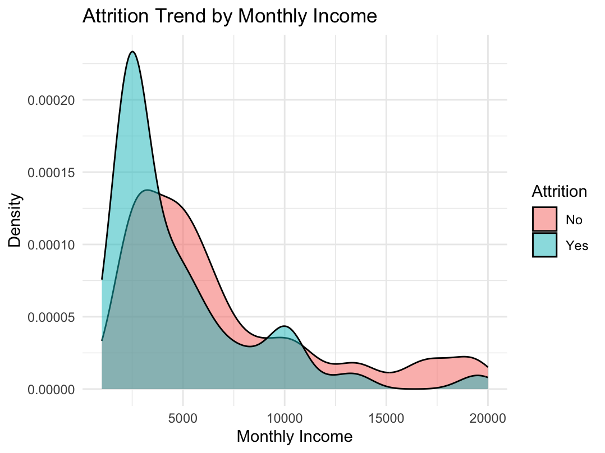
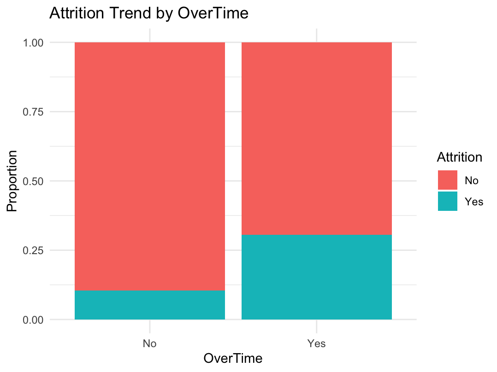
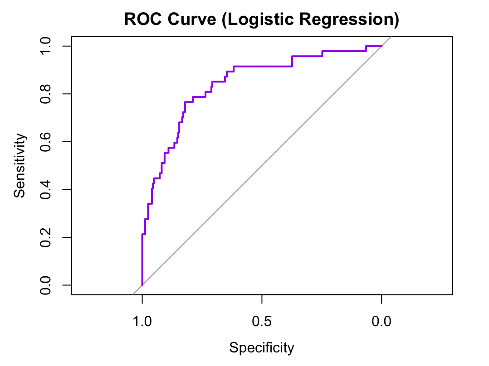
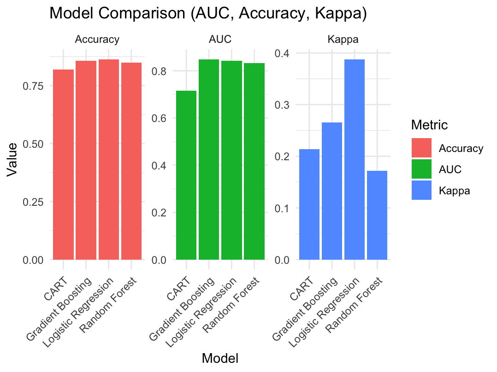

# Employee Attrition Prediction

## Overview
This project analyzes employee attrition using the IBM HR Analytics Employee Attrition dataset and compares multiple machine learning models built in R. The goal is to identify key drivers of employee turnover and support retention-focused business decisions through predictive analytics.

## Business Problem
Employee attrition increases hiring costs, training costs, productivity loss and operational disruption. This project helps identify employee characteristics associated with attrition and compares predictive models that can support earlier HR intervention.

## Dataset
- Source: IBM HR Analytics Employee Attrition dataset
- Records: 1470 employees
- Features: 35 columns in the original dataset
- Data quality checks: dimensions, missing values, duplicates, descriptive statistics and summary review

## Tools and Libraries
R, readr, dplyr, psych, ggplot2, caret, randomForest, pROC, gbm, rpart, rpart.plot, glmnet

## Project Workflow
1. Loaded and explored the dataset.
2. Checked dataset dimensions, missing values and duplicates.
3. Removed non-predictive columns such as EmployeeNumber and Over18.
4. Reviewed descriptive statistics and top correlations among numeric variables.
5. Converted categorical variables to factors for modeling.
6. Created exploratory visualizations for attrition trends.
7. Split the dataset into training and test sets.
8. Built and evaluated Random Forest, Gradient Boosting, CART and Logistic Regression models.
9. Compared models using AUC, Accuracy, Kappa, MAE, RMSE and R-squared.

## Key Insights
- Overtime was strongly associated with higher attrition.
- Lower monthly income showed greater attrition risk.
- Early-career and lower-tenure employees showed higher attrition.
- Some job roles, especially sales-related roles, showed higher turnover patterns.
- Distance from home also showed a relationship with attrition.

## Models Used
- Random Forest
- Gradient Boosting Machine (GBM)
- CART
- Logistic Regression

## Evaluation Metrics
- AUC
- Accuracy
- Kappa
- MAE
- RMSE
- R-squared
- Confusion matrices
- ROC curves

## Selected Visuals

| Attrition by Monthly Income | Attrition by OverTime |
|---|---|
|  |  |

| Logistic Regression ROC Curve | Model Comparison |
|---|---|
|  |  |

## Repository Structure
```text
employee-attrition-prediction/
│
├── README.md
├── .gitignore
├── employee_attrition_prediction.R
├── WA_Fn-UseC_-HR-Employee-Attrition.csv
│
├── images/
│   ├── attrition_by_age.png
│   ├── attrition_by_monthly_income.png
│   ├── attrition_by_total_working_years.png
│   ├── attrition_by_job_role.png
│   ├── attrition_by_overtime.png
│   ├── attrition_by_distance_from_home.png
│   ├── attrition_by_years_at_company.png
│   ├── logistic_regression_roc.png
│   ├── random_forest_roc.png
│   ├── gradient_boosting_roc.png
│   ├── cart_roc.png
│   ├── logistic_regression_confusion_matrix.png
│   ├── random_forest_confusion_matrix.png
│   ├── gradient_boosting_confusion_matrix.png
│   ├── cart_confusion_matrix.png
│   ├── model_comparison_auc_accuracy_kappa.png
│   ├── model_comparison_mae_r_squared_rmse.png
│   └── decision_tree.png
│
└── report/
    └── employee_attrition_project_report.pdf
```

## How to Run
1. Open the project in R or RStudio.
2. Install the required packages if they are not already installed.
3. Keep the CSV file in the project root folder.
4. Run the script from top to bottom.

## Output
The project produces exploratory visualizations, model summaries, variable importance output, confusion matrix plots, ROC curves and model comparison plots.

## Author
Nitish Harinkhere
